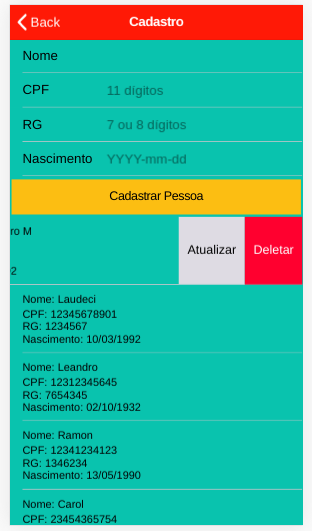

# IonicApp

Aplicativo de controle de uso de aplicações.

## Pré-requisitos

Criação do banco de dados em MySQL sendo a database com o nome 'ionic'.

## Informações

### Apos a clonagem do projeto para um diretório, seguir os seguintes passos:

Configurar o arquivo .env da pasta BackendLumen, definindo o DB_USERNAME e o DB_PASSWORD para conexão com o banco de dados.

Verificar se o serviço do MySQL está rodando.

```
/etc/init.d/mysql status
```
Caso esteja parado, executar o comando:

```
/etc/init.d/mysql start
```

Iniciar o browser desabilitando a segurança (chrome ou chromium).

```
<chromium|chrome> --disable-web-security --user-data-dir --allow-file-access-from-files
```

Acessar o diretório raiz.

```
cd IonicApp/
```
Iniciar o processo do PHP.

```
php -S localhost:8000 -t BackendLumen/public/ > /dev/null &
```
Acessar o diretório contendo os arquivos do ionic

```
cd FrontEndIonic/
```
Iniciar o simulador do ionic (chromium ou chrome)

```
ionic serve --browser=<chromium|chrome>
```

## Funcionalidades

Para acessar as opções de atualização de deleção de registro, deslizar o mesmo para a esquerda.


